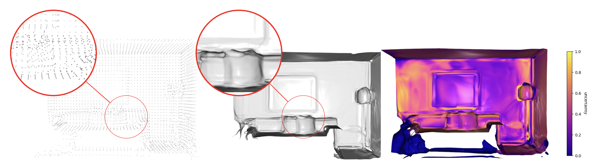
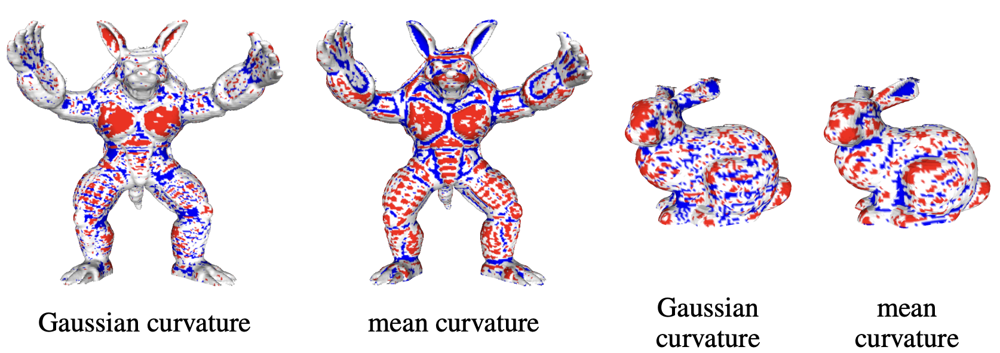
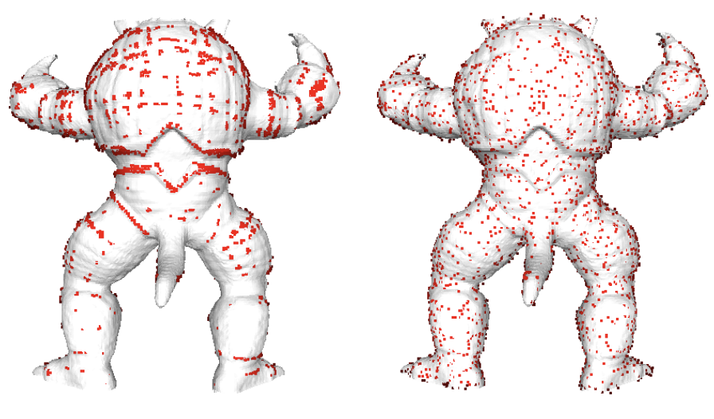
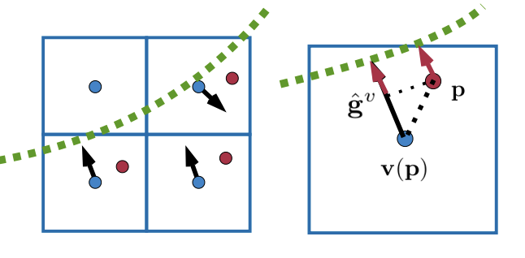
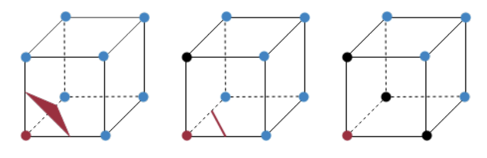
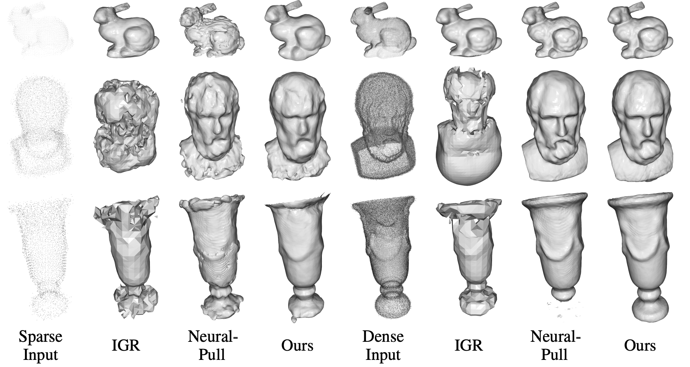
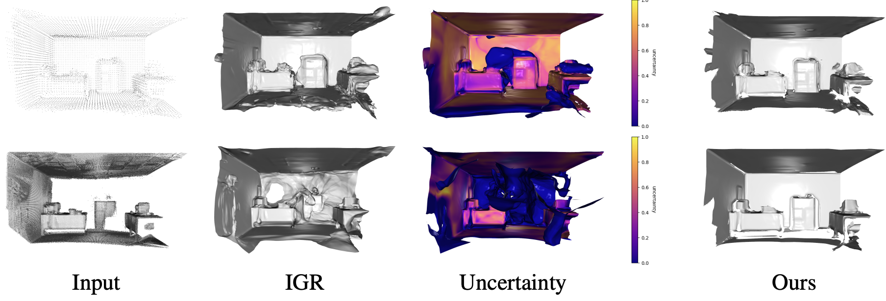

***Enhancing Surface Implicits.** We introduce a sampling method with an uncertainty-augmented surface implicit representation that employs a sampling technique that considers the geometric characteristics of inputs. To this end, we introduce a strategy that efficiently computes differentiable geometric features, namely, mean curvatures, to augment the sampling phase during the training period. The uncertainty augmentation offers insights into the occupancy and reliability of the output signed distance value, thereby expanding representation capabilities into open surfaces.*

# Abstract

Neural implicits have become popular for representing surfaces because they offer an adaptive resolution and support arbitrary topologies. While previous works rely on ground truth point clouds, they often ignore the effect of input quality and sampling methods during reconstructing. In this paper, we introduce a sampling method with an uncertainty-augmented surface implicit representation that employs a sampling technique that considers the geometric characteristics of inputs. To this end, we introduce a strategy that efficiently computes differentiable geometric features, namely, mean curvatures, to augment the sampling phase during the training period. The uncertainty augmentation offers insights into the occupancy and reliability of the output signed distance value, thereby expanding representation capabilities into open surfaces. Finally, we demonstrate that our method leads to state-of-the-art reconstructions on both synthetic and real-world data.

# Overview

<!--  -->

a) We introduce a novel method, which can deal with sparse input data to reconstruct surfaces ranging from single objects to large scenes using the same framework. 

b) We propose a method that computes mean curvature directly from input depth images and uses it as a curvature-guided sampling strategy, which considers the geometric feature of the input to enhance the training efficiency.

c) We introduce an uncertainty-aware implicit neural representation that gives an uncertainty of predictions and enables open surface presentation.

# Curvature Computation and Curvature Guided Sampling

***Gaussian curvature and mean curvature.** We direct compute curvature information from depth images and integrate them into voxels Figure shows the low (blue) curvature area and high (red) curvature area.* 

Depth images can provide more geometric information other than normals. To solve the biased sampling problem, we propose directly incorporating mean curvature during the voxelization step to help with the sampling procedure during training. To our knowledge, we are the first to integrate mean curvatures, computed from depth images, with voxels for efficient sampling afterward. A depth image can be viewed as a Monge patch of a surface, i.e. $$z = D(m,n), (m,n) \in \Omega \subset \mathbb{R}^2$$ with pixel coordinates $$(m,n)$$ lay in the image domain $$\Omega$$. Thus, the Monge patch $$\boldsymbol{M}: \Omega \to \mathbb{R}^3$$ is 
$$\boldsymbol{M}(m,n) = (m, n, D(m,n))$$. To compute the two types of curvatures from the depth 

$$
K(m,n)  = \frac{D_{mm}D_{nn} - D_{mn}^2}{(1+D_m+D_n)^2} \\
H(m,n)  = \frac{(1+D_m^2)D_{nn} - 2D_m D_n D_{mn} + (1+D_n^2)D_{mm}}{2 (1+D_m^2 + D_n^2)^{3/2}}
$$

***Curvature guided sampling.** To sample points using curvature information. Left images is the high curvature gathering effect when directly sampling using voxels, right side is sample using our methods.* 

To avoid the uneven sampling problem, we divide sampled points into low, median, and high curvature regions. For each epoch, m points are sampled from low curvature category $$\hat{\mathbf{p}} \sim \{\mathbf{p} \in \Gamma \| H^p < \underline{H}\}$$, median curvature category $$\hat{\mathbf{p}} \sim \{\mathbf{p}\in\Gamma \| \underline{H} \leq H^p < \bar{H}\}$$, and high curvature category $$\hat{\mathbf{p}} \sim \{\mathbf{p} \in\Gamma \| H^p \geq \bar{H}\}$$.

# Voxel-based sampling

***voxel interpolation sampling.** Allows us to get SDF value of any point in the space. To efficiently dealing with sparse input data.*

we introduce an interpolation strategy that deals with the sparse input and uses the gradient and curvature information. With the initialized coarse voxel representation $$\{\mathbf{v}_i\}$$, we first sample a random point $$\mathbf{p} \in \Gamma$$ in 3D space, where $$\Gamma \subset \mathbb{R}^3$$ is the sampling domain. With the help of the voxel grid structure, we can localize in which voxel the point $$\mathbf{p} \in \mathbb{R}^3$$ lies and denote the coordinate of the voxel center as $$\mathbf{v}(\mathbf{p})  \in \mathbb{R}^3$$. Then, the signed distance value of the sampled point $\mathbf{p}$ can be easily computed by Taylor expansion with the help of the stored gradient $$\mathbf{g}^v$$ as

$$
\psi^p = \psi^v + <\hat{\mathbf{g}}^v, \mathbf{p} - \mathbf{v}(\mathbf{p})> \,,
$$

where $$\hat{\mathbf{g}}^v = \frac{\mathbf{g}^v}{\lVert\mathbf{g}^v\rVert}$$ is the normalized gradient of the distance field. 

# Uncertainty-Aware Implicit Surface Reconstruction

We would like to recover the neural implicit function $$f:\mathbb{R}^3 \to (\psi, w) \subset \mathbb{R}\times[0,1]$$, such that the surface lies on the level-set $$\{\mathbf{x} | f(\mathbf{x}) \in 0 \times (\tau,1] \}$$, and w is the uncertainty of the predicted signed distance value $$\psi$$. $$\tau$$ is the uncertainty threshold.
Given a point $$\mathbf{p}$$ in the sample domain $$\Gamma$$, its corresponding voxel $$\mathbf{v}(\mathbf{p})$$ with the interpolated SDF value $$\psi^p$$ and uncertainty $$w^p$$, we define the loss function of the geometric and the normal constraints as

$$
    \mathit{l}_\boldsymbol{X}(\theta) = \frac{1}{\|\Gamma^+\|}\int_{\Gamma^+} (\|\psi - \psi^p\|)d\Gamma \,,  \\
    \mathit{l}_{\boldsymbol{N}} (\theta) = \frac{1}{\|\Gamma^+\|} \int_{\Gamma^+} (1- <\frac{\nabla_{\psi} f(\mathbf{p}, \theta)}{\lVert\nabla_{\psi} f(\mathbf{p}, \theta)\rVert}, \hat{\mathbf{g}}>)d\Gamma \,,  \\
    \mathit{l}_{\boldsymbol{W}}(\theta_r) = \int_{\Gamma} \|w - w^p\|d\Gamma \,, \\
    \mathit{l}_{\boldsymbol{E}}(\theta) =  \int_{\Gamma} \|\lVert\nabla_\psi f(\mathbf{p},\theta)\rVert^2 - 1\| d\Gamma \,,
$$

where $$\Gamma^+$$ indicates the area with the sampled uncertainty $$w^p>0$$.

# Open Surface Reconstruction

***Marching cubes with uncertainty.** The by-product uncertainty allows us to treat open area as 0-uncertainty place. Thus by modifying marching cubes algorithm we can reconstruct open surface without extra effort.*

# Results

***Reconstruction results.** Reconstrution results compare with other methods.*

***Uncertainty Reconstruction results.** Reconstrution results compare with other methods.*