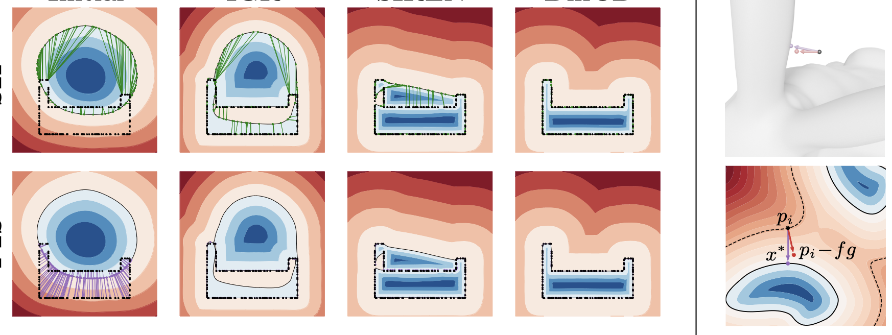

***DiffCD.** We propose a novel loss function corresponding to the symmetric Chamfer distance to address these shortcomings. It assures both that the points are near the surface and that the surface is near the points. Our approach reliably recovers a high level of shape detail and eliminates spurious surfaces without the need for additional regularization. To make our approach more practical, we further propose an efficient method for uniformly sampling point batches from the implicit surface.*

# Abstract

Fitting neural implicit surfaces to point clouds is typically done by encouraging the network output to equal zero on the point cloud. Yet, since the underlying shape metric is not symmetric, previous methods are susceptible to spurious surfaces. We theoretically analyze the predominant approach for dealing with spurious surfaces, and show that it is equivalent to regularizing the surface area, leading to over-smoothing. We propose a novel loss function corresponding to the symmetric Chamfer distance to address these shortcomings. It assures both that the points are near the surface and that the surface is near the points. Our approach reliably recovers a high level of shape detail and eliminates spurious surfaces without the need for additional regularization. To make our approach more practical, we further propose an efficient method for uniformly sampling point batches from the implicit surface. 