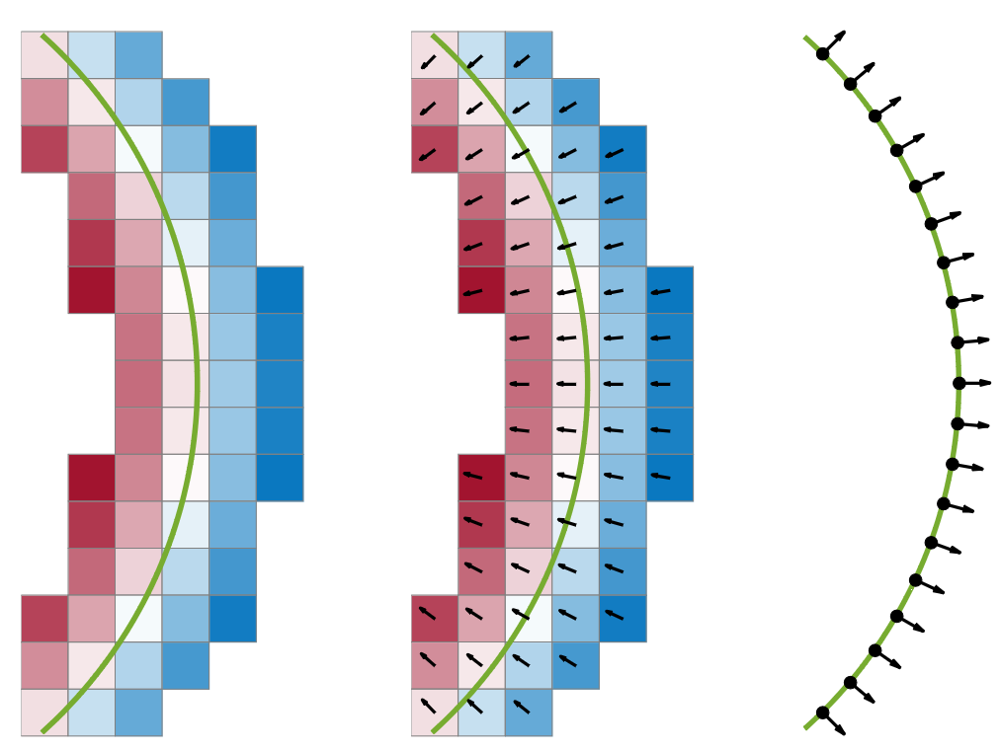
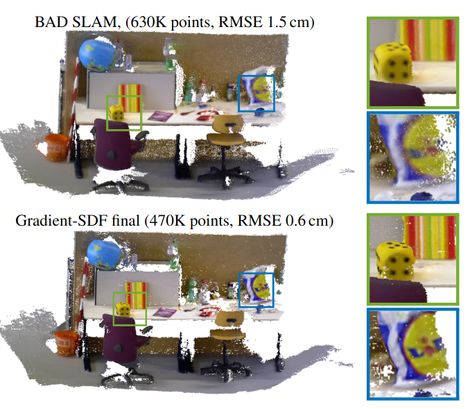
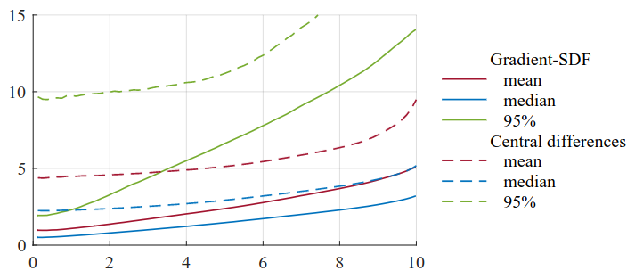

***Gradient-SDF.** Our Gradient-SDF (*middle*) is a hybrid representation between standard signed distance fields stored in a voxel grid (*left*) and the explicit geometry representation using surfels (*right*): while we inherit the implicit nature of standard SDF voxels, we store gradients per voxel, which is similar to the surface normal property of a surfel. This combines the advantages of implicit representations, such as the possibility for direct SDF tracking, with those of explicit ones, for instance the possibility to perform bundle adjustment.*

# Abstract

We present *Gradient-SDF*, a novel representation for 3D geometry that combines the advantages of implict and explicit representations. By storing at every voxel both the signed distance field as well as its gradient vector field, we enhance the capability of implicit representations with approaches originally formulated for explicit surfaces. As concrete examples, we show that (1) the Gradient-SDF allows us to perform direct SDF tracking from depth images, using efficient storage schemes like hash maps, and that (2) the Gradient-SDF representation enables us to perform photometric bundle adjustment directly in a voxel representation (without transforming into a point cloud or mesh), naturally a fully implicit optimization of geometry and camera poses and easy geometry upsampling. Experimental results confirm that this leads to significantly sharper reconstructions. Since the overall SDF voxel structure is still respected, the proposed Gradient-SDF is equally suited for (GPU) parallelization as related approaches.

# Overview

a) We propose Gradient-SDF as an implicit geometry representation with explicit features. It exploits first-order Taylor expansion to perform interpolation without accessing several voxels.

b) We prove that our stored Gradient-SDF vectors are significantly more accurate than gradients obtained by standard finite difference schemes.

c) We show theoretically and experimentally how Gradient-SDF can be used in a depth-based tracking and mapping system, where efficient storage in a hash map is combined with direct SDF tracking.

# Camera Tracking Using Gradient-SDF

***Reconstructed point cloud***

we augment the voxel structure by an additional 3D vector, namely a scaled gradient $$\boldsymbol{g}_j$$ of the SDF at that point.

This proposed data structure is visualized in [teaser figure](assets/teaser.png).
For a signed distance function, the gradient at a point $\boldsymbol{p}$ is equal to the inwards-pointing surface normal at the closest surface point, and the negative of the outwards-pointing surface normal.
Thus, $\boldsymbol{g}_j$ can be updated in a straightforward way:
$$
    \boldsymbol{g}_j \leftarrow \boldsymbol{g}_j + w(\boldsymbol{v}_j)\boldsymbol{n}(\boldsymbol{v}_j)
$$

In most applications, normals are already computed from the incoming data (e.g., depth maps) for filtering or rendering, so the computation of $\boldsymbol{n}(\boldsymbol{v}_j)$ does not introduce any computational overhead.
We normalize the weighted sum $\boldsymbol{g}_j$ to get the actual gradient estimate $$\hat{\boldsymbol{g}}_j$$ at $$\boldsymbol{v}_j$$.

## Camera Tracking via Gradient-SDF

With our data structure, we can easily approximate both $$d_\boldsymbol{S}$$ and $$\nabla d_\boldsymbol{S}$$ with only one single voxel look-up, using a first-order Taylor expansion:

$$
    d_\boldsymbol{S}^\text{our}(\boldsymbol{p}) = \psi_{0} + (\boldsymbol{p}-\boldsymbol{v}_{j^*})^\top\hat{\boldsymbol{g}}_{j^*} \\
    \nabla d_\boldsymbol{S}^\text{our}(\boldsymbol{p}) = \hat{\boldsymbol{g}}_{j^*} \\
    j^* = \text{argmin}_j ||\boldsymbol{p}-\boldsymbol{v}_j||
$$

This looks very similar to the ICP-based formulation, but in our case $$j^*$$ can be computed without any neighbor search simply by rounding $$\boldsymbol{p}/v_s$$, as we know that the $$\boldsymbol{v}_j$$ are sampled on a regular grid in $$\boldsymbol{R}^3$$.

As a consequence, contiguous memory storage that is so beneficial for volumetric direct SDF tracking approaches is no longer as important, and we can use a hash map instead to compactly store our voxels, while still staying within one geometry representation. This allows us to store larger volumes just like in usual SDF tracking, where voxels far from the surface (i.e., with zero weight) are not explicitly stored.

## Pose optimization and bundle adjustment

while it is very hard to come up with a meaningful bundle adjustment energy in standard SDF representations, we can exploit projecting voxel center to surface to define points on the surface for which we want to adjust bundles.
Together with the finding of BAD SLAM that optimization can be limited to the normal direction, we can set up an *implicit photometric BA* cost:

$$
    E(\{\boldsymbol{R}_i, \boldsymbol{t}_i\}, \psi) =
    \sum_{i,j,c}{\nu_{ij}\Phi\bigl(I_{ij}^c- \tfrac{1}{N_j}\sum_k{\nu_{kj}I_{kj}^c}\bigr)}
$$

where $$\nu_{ij}$$ denotes the visibility of voxel $$\boldsymbol{v}_j$$ in frame i ($$N_j=\sum_i{\nu_{ij}}$$), $$c\in\{\text{r},\text{g},\text{b}\}$$, and $$\Phi$$ is a robust cost function.
$$I_{ij}^c$$ is given by

$$
    I_{ij}^c(\{\boldsymbol{R}_i, \boldsymbol{t}_i\}, \psi_j) =
    I_i^c\left( \pi(\boldsymbol{R}_i^\top(\boldsymbol{v}_j-\psi_j\hat{\boldsymbol{g}}_j-\boldsymbol{t}_i))\right)
$$

with $$\pi$$ the perspective projection from $$\boldsymbol{R}^3$$ to the image domain.

## Gradient quality on synthetic data

Quality of gradient estimates. For all voxels closer than x voxels to the surface, the y-value of the curves specify mean, median and 95th percentile of the angular deviation from ground truth gradients in degrees. Solid lines are Gradient-SDF vectors, and dashed lines central finite differences. Our gradients are significantly more accurate than those computed using finite differences, e.g. the mean angular deviation of voxels within 10vs from the surface is nearly twice as big for central differences ($$9.49 ^{\circ}$$ ) than for our stored gradients ( $$5.07^{\circ}$$ ).
