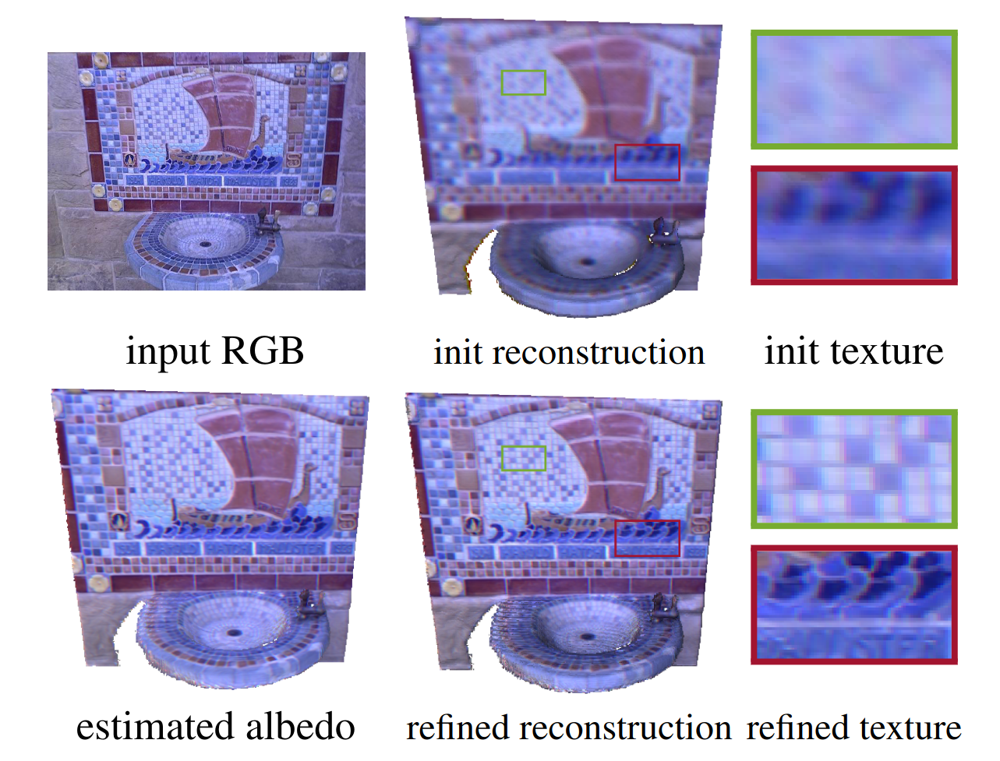
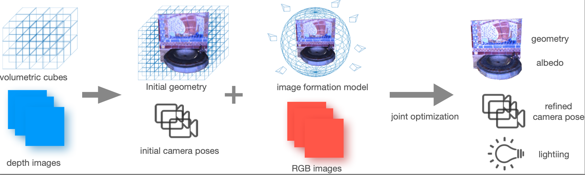
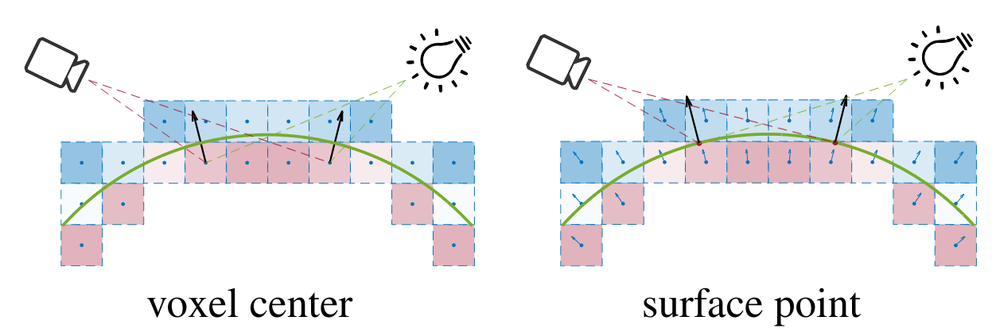
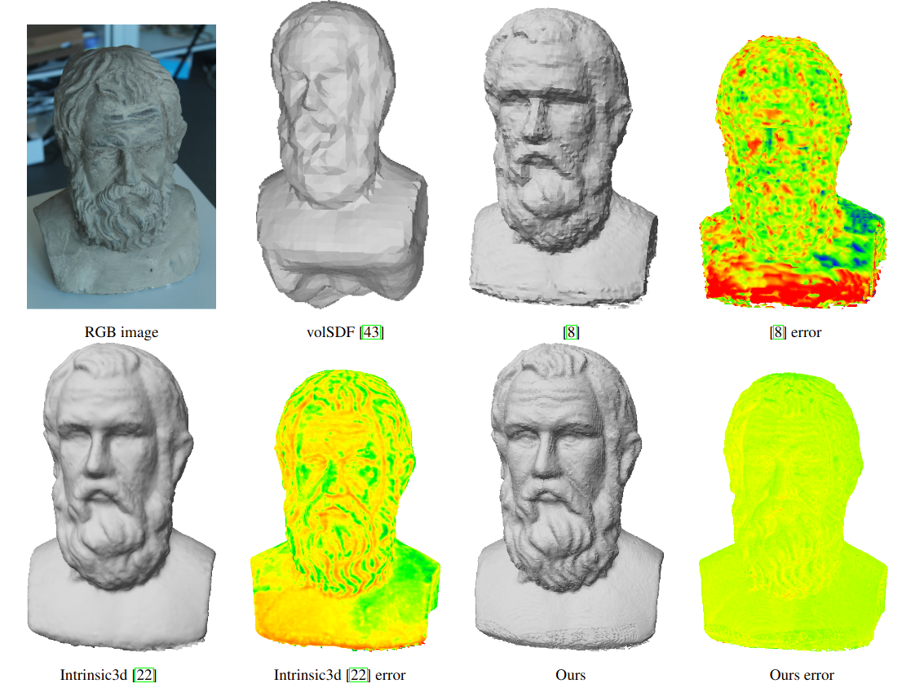
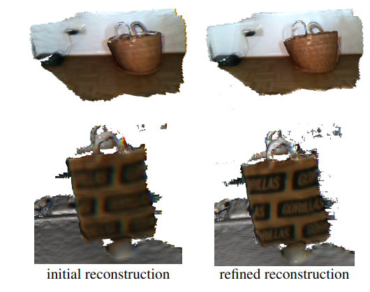

***High-Quality RGBD Reconstruction.** We propose a novel multi-view RGB-D based reconstruction method that tackles camera pose, lighting, albedo, and surface normal estimation via the utilization of a gradient signed distance field (gradient-SDF). It formulates the image rendering process using specific physically-based model(s) and optimizes the surface's quantities on the actual surface using its volumetric representation.*

# Abstract

Fine-detailed reconstructions are in high demand in many applications. However, most of the existing RGB-D reconstruction methods rely on pre-calculated accurate camera poses to recover the detailed surface geometry, where the representation of a surface needs to be adapted when optimizing different quantities. In this paper, we present a novel multi-view RGB-D based reconstruction method that tackles camera pose, lighting, albedo, and surface normal estimation via the utilization of a gradient signed distance field (gradient-SDF). The proposed method formulates the image rendering process using specific physically-based model(s) and optimizes the surface's quantities on the actual surface using its volumetric representation, as opposed to other works which estimate surface quantities only near the actual surface. To validate our method, we investigate two physically-based image formation models for natural light and point light source applications. The experimental results on synthetic and real-world datasets demonstrate that the proposed method can recover high-quality geometry of the surface more faithfully than the state-of-the-art and further improves the accuracy of estimated camera poses.

# Overview

a) We propose a novel formulation of physically realistic image model(s) compatible with a volumetric representation which enables effective optimization on actual surface points.

b) It completes reconstruction pipeline with the capability of camera pose, geometry refinement, albedo and lighting estimation.

c) It is a method that deals with natural and point light source scenarios in an uncalibrated setting which are convenient to adopt in real applications.

# Voxel center vs. Surface point

The key idea of the proposed method is describing the explicit surface under an implicit representation, i.e., under a volumetric cube. To perform all the operations on the actual surface, we must find the corresponding surface point to each voxel. To combine the advantage of surface point representation with volumetric representation, gradient-SDF stores the signed distance $\psi^j$ for each voxel $$\boldsymbol{v}^j$$ for $$j\in\mathcal{V}$$, together with the distance gradient $$\boldsymbol{g}^j$$ of this voxel. It allows us to easily compute the surface point $$\boldsymbol{x}^j$$ by moving along the gradient direction $$\boldsymbol{g}^j$$ with the voxel distance $$\psi^j$$ 

$$
 \boldsymbol{x}^j = \boldsymbol{v}^j - \boldsymbol{g}^j\psi^j
$$

# Natural Lighting Model

A *natural light* source situation is, for example, the light source is the sun, or when the light sources are in a distance. The lighting directions that reach the surface are nearly parallel, then the environment lighting can be well modeled using Spherical Harmonics (SH) functions. The integral part is approximated by the sum of SH basis.

$$
   \boldsymbol{I}(\boldsymbol{p}(\boldsymbol{x})) \approx \pho(\boldsymbol{x})<\boldsymbol{l}, \boldsymbol{SH}(\boldsymbol{n}(\boldsymbol{x}))>\,,
$$

where $$\boldsymbol{l} \in \mathbb{R}^4$$ is an 4-dimensional lighting vector for the current view and $$\boldsymbol{SH}(\boldsymbol{n}(\boldsymbol{x}))\in \mathbb{R}^4$$ are the first-order SH basis functions for a fixed $$\boldsymbol{n}(\boldsymbol{x})$$. 
The model is simply formulated and still can reach relatively high accuracy with a low order model. 

# Point light Source Model

Apart from the natural light, another commonly encountered scenario is the point light source situation, mainly when focusing on small object reconstruction. The object is usually illuminated by a *point light source*, e.g., a LED light that is close to the object. The lighting can hardly be regarded as a set of parallel lines, thus point light source provides more changes to the object illumination, which is preferred to deal with the ill-posedness of the PS model. One widely used point light source-light model is:

$$
    \boldsymbol{I}(\boldsymbol{p}(\boldsymbol{x})) = \Psi^s \pho(\boldsymbol{x}) (\frac{<\boldsymbol{n}^s,\boldsymbol{l}^s>}{||\boldsymbol{l}^s||})^{\mu^s} \frac{\max(<\boldsymbol{n}(\boldsymbol{x}),\boldsymbol{l}^s>, 0)}{||\boldsymbol{l}^s||^3}\,,
$$

where $$\Psi^s$$ is the light source intensity, $$\boldsymbol{n}^s$$ is the principal direction of the light source, and $$\boldsymbol{l}^{s}$$ is the vector pointing from the light location to the surface point. The denominator term $$\lVert\boldsymbol{l}^{s}\rVert^3$$ describes the attenuation of the light intensity when it reaches the surface point. $$\mu^s \geq 0$$ is the anisotropy parameter.

# Results

***Reconstruction results.** Reconstrution results compare with other methods under Natural light conditions.*

***Reconstruction results.** Reconstrution results under point light source conditions, uncalibrated.*
