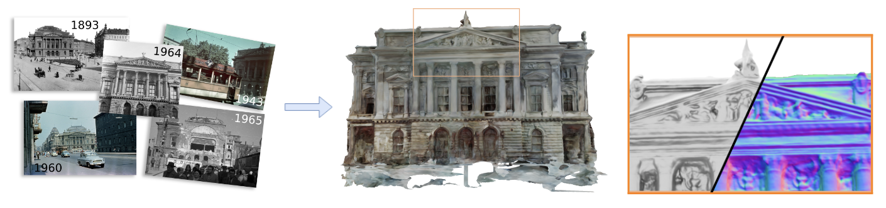
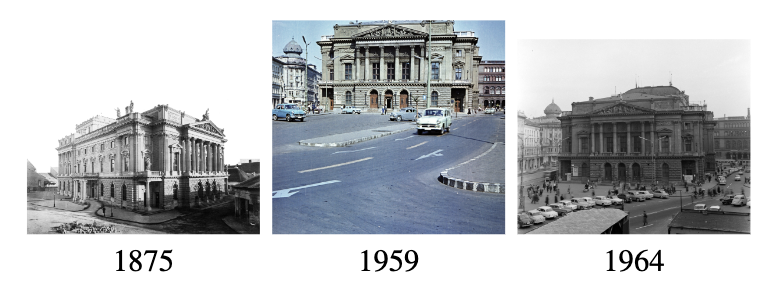
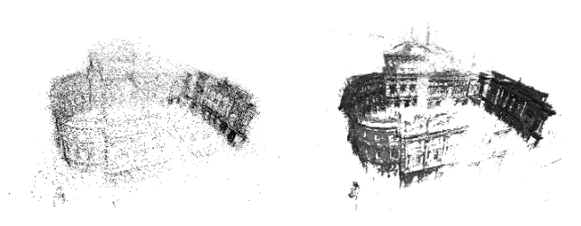

***Historical building reconstruction.** Historical photographs are often limited in number and the scenes in these photos might have altered over time. The radiometric quality of these images is also often sub-optimal. To address these challenges, we introduce an approach to reconstruct the geometry of historical buildings, employing volumetric rendering techniques. We leverage dense point clouds as a geometric prior and introduce a color appearance embedding loss to recover the color of the building given limited available color images.*

# Abstract

Historical buildings are a treasure and milestone of human cultural heritage. Reconstructing the 3D models of these building hold significant value. The rapid development of neural rendering methods makes it possible to recover the 3D shape only based on archival photographs. However, this task presents considerable challenges due to the limitations of such datasets. Historical photographs are often limited in number and the scenes in these photos might have altered over time. The radiometric quality of these images is also often sub-optimal. To address these challenges, we introduce an approach to reconstruct the geometry of historical buildings, employing volumetric rendering techniques. We leverage dense point clouds as a geometric prior and introduce a color appearance embedding loss to recover the color of the building given limited available color images. We aim for our work to spark increased interest and focus on preserving historical buildings. Thus, we also introduce a new historical dataset of the Hungarian National Theater, providing a new benchmark for the reconstruction method.

# Overview

<!--  -->

a) We propose a method that is able to reconstruct satisfactory 3D geometry of historical buildings by leveraging sparse and low-quality images.

b) We propose a color appearance embedding loss to obtain a color synthetic view when the majority of photos are gray-scale.

c) We publish a historical dataset that showcases a wide range of properties typically present in historical datasets.

<iframe src="https://benaco.com/embed/6c7ecafc-3db4-409e-8afa-3d79f12eb4b1" scrolling="no" frameborder="0" allowfullscreen style="width: 100%; height: 60vh; display: block;"></iframe>
Drag to look around, click on floor markers to select camera view and press , or . to step through cameras.
Image sources: [Fortepan](https://fortepan.hu/), [Metropolitan Ervin Szabó Library](https://foto.fszek.hu/WebPac_kep/?language=1) and [MTVA Archive](https://archivum.mtva.hu/photobank)

# Historical Dataset

***Image example.** The old photos have poor quality and the building may alter along the years, these makes historical building reconstruction challenging.*

Reconstructing historical buildings based on archival photography provides significant value not only in the research area but also considering the protection and preservation of cultural heritage. However, historical images of the same building are often scattered in multiple archives with often unresolved copyrights and only a few historical datasets are available for research purposes. Thus, we introduce the *Hungarian National Theater dataset*.
   
   dataset         | Total image | color | Train
------------------ | ----------- | ----- | ----- 
National Theater   |     229     |   16  |  153
Hotel International|     19      |   1   |  18
Observatory        |     37      |   3   |  33
St. Michael Church |     17      |   0   |  16

This dataset is a rare case of having a complete photo collection covering the whole area around an old building that is no longer present. All four sides appear in different numbers of images in the dataset.

# Backbones and Geometry Loss

***Sparse and dense point cloud.** We use a dense point cloud instead of the sparse point cloud because we believe the dense point cloud provides complementary information, left is the sparse point cloud and right is the dense point cloud.*

We build our method on top of NeusW. Our network architecture consists of two parts, an SDF net and a color prediction net. The SDF net estimates the signed distance value $$d\in\mathbb{R}$$ and a geometric feature $$\boldsymbol{f}\in\mathbb{R}^{f_n}$$, for $f_n$ is the dimension of the feature vector. Given point $$\boldsymbol{x}\in\mathbb{R}^3$$, the color prediction net outputs the rendered color $$\boldsymbol{c}$$. In detail, given points $$\boldsymbol{x}$$, viewing direction $$\boldsymbol{v}\in\mathbb{S}^2$$, we compute normal $$\boldsymbol{n}=\nabla \text{MLP}_{\text{SDF}}(\boldsymbol{x})$$, 

$$
  (d,\boldsymbol{f}) = \text{MLP}_{\text{SDF}}(\boldsymbol{x}) \\
  \boldsymbol{c}_i = \text{MLP}_{\text{color}}(\boldsymbol{x}, \boldsymbol{v}, \boldsymbol{n}, \boldsymbol{e}_i, \boldsymbol{f})
$$

The geometry loss is 

$$
\mathit{l}_{g}(\boldsymbol{x}) = \lambda \frac{1}{\|\boldsymbol{P}_i\|}\sum_{\boldsymbol{x} \in \boldsymbol{P}_i}{\|\text{MLP}_{\text{SDF}}(\boldsymbol{x})\|}\,,
$$

where $$\|\boldsymbol{P}_i\|$$ is the number of points in the point cloud and $\lambda$ is a learnable parameter.

# Color Appearance Embedding

To deal with the situation that most of the input images are available as gray-scale, and only a small portion provides color channels, we propose a color appearance embedding loss to recover color output. The color net outputs a three-channel color vector, to supervise it using gray-scale images, we use perceptual weights to convert the output color to gray-scale value, i.e., for $$\boldsymbol{C}^{\prime}(\boldsymbol{r}) = (c_r, c_g, c_b)$$, we propose the function $$g:\mathbb{R}^3 \to \mathbb{R}$$ and

$$
    g(\boldsymbol{C}^{\prime}(\boldsymbol{r})) = w_r c_r + w_g c_g + w_b c_b\,,
$$

where $$w_r=0.2126$$, $$w_g=0.7152$$ and $$w_b=0.0722$$. 
The loss for ray color $$\boldsymbol{C}^{\prime}(\boldsymbol{r})$$ in image with true color $$\boldsymbol{C}(\boldsymbol{r})$$ is

$$
    \mathit{l}_c(\boldsymbol{r}) = \begin{cases}
    \frac{1}{2}  \|\boldsymbol{C}(\boldsymbol{r}) - g(\boldsymbol{C}^{\prime}(\boldsymbol{r}))\|^2, & \text{if}~ \boldsymbol{r}~\text{is gray-scale} \,, \\
    \frac{1}{2}  \|\boldsymbol{C}(\boldsymbol{r}) - \boldsymbol{C}^{\prime}(\boldsymbol{r})\|^2,              & \text{otherwise}\,.
\end{cases}
$$

# Results

<video width="100%" autoplay muted loop>
  <source src="./assets/historical.mp4" type="video/mp4">
Your browser does not support the video tag.
</video>

