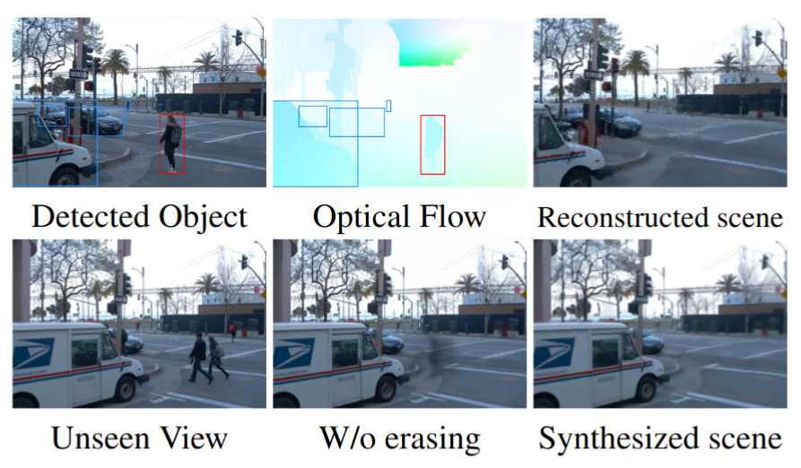
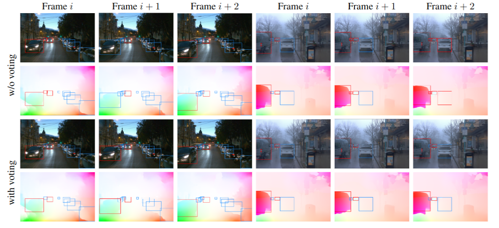
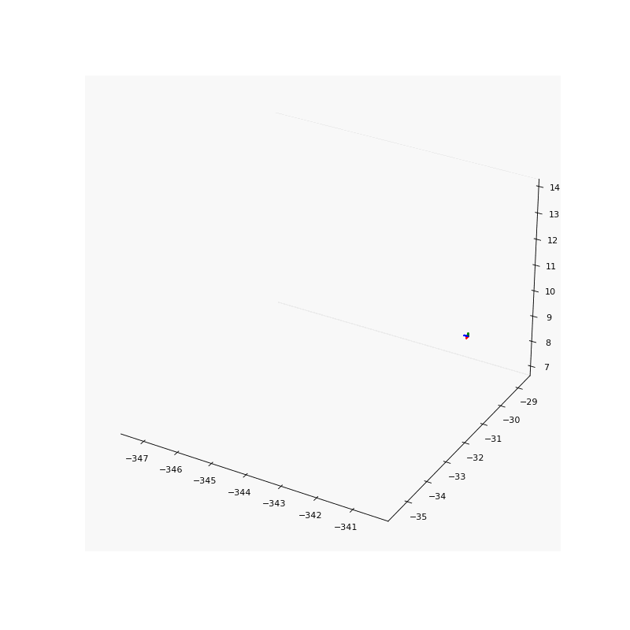
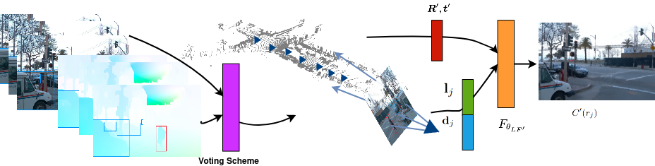

<video width="100%" autoplay muted loop>
  <source src="./assets/street.mp4" type="video/mp4">
Your browser does not support the video tag.
</video>

***Reconstructed views on Waymo.** Reconstructed scenes of a sequence from Waymo dataset. Our method can eliminate moving objects on the street.*

# Abstract

Synthesizing novel views for urban environments is crucial for tasks like autonomous driving and virtual tours. Compared to object-level or indoor situations, outdoor settings present unique challenges such as inconsistency across frames due to moving vehicles and camera pose drift over lengthy sequences. In this paper, we introduce a method that tackles these challenges on view synthesis for outdoor scenarios. We employ a neural point light field scene representation and strategically detect and mask out dynamic objects to reconstruct novel scenes without artifacts. Moreover, we simultaneously optimize camera pose along with the view synthesis process, and thus we simultaneously refine both elements. Through validation on real-world urban datasets, we demonstrate state-of-the-art results in synthesizing novel views of urban scenes.  

# Overview

a) We incorporate novel view synthesis with dynamic object erasing which removes artifacts created by inconsistent frames in urban scenes. 

b) We propose a voting scheme for dynamic object detection to achieve consistent classification of moving objects.

c) During training, we jointly refine camera poses and demonstrate the robustness of our method to substantial camera pose noise. As a result, image quality is elevated with the increased accuracy of camera poses.

# Moving Object Detection

***Moving object detection**. Comparison with and without voting scheme.*

we employ a voting scheme to reduce inconsistencies in motion prediction that may be caused by incorrect optical field computation or the inconsistencies introduced by ego-motion. In frame $j$ where the object with instance $i$ appears, we compute the motion score $$m_j^i\in \{0,1\}$$, where 1 and 0 denote moving and non-moving objects respectively. Thus, each object has a sequence of motion labels $$\{m^i_n\}_n$$ (out side $n$ means iterate over $$n$$) indicating their motion statuses over frames. Finally, the motion status $M^i$ of an object instance $i$ across the scene is set as

$$
  M^{i} = \begin{cases}
        1 \text{ if } \text{med}(\{m^i_n\}_n) \geq 0.5 \,, \\
        0 \text{ otherwise }\,,
          \end{cases}
$$

where $$\text{med}(\{m^i_n\}_n)$$ is the median of the motion labels for object $i$ in the sequence $$\{m^i_n\}_n$$. If an instance object is labeled as 1, we denote this object as moving over the entire sequence.

# Pose Refinement

<table><tr>
<td>  </td>
<td>  </td>
</tr></table>

<!-- {width=50%} | {width=50%} -->
***Pose refinement results**. Noise pose (left) and refined pose (right) of our results.*

To solve the aforementioned inaccurate camera pose problem, we jointly refine the camera poses with the point light field to account for these potential inaccuracies.
We use the logarithmic representation of the rotation matrix such that the direction and the $l2$ norm of the rotation vector $$\boldsymbol{R} \in \mathbb{R}^{3}$$ represents the axis and magnitude of rotation of the camera in the world-to-camera frame respectively. The translation vector $$\boldsymbol{t} \in \mathbb{R}^{3}$$ represents the location of the camera in the world-to-camera frame.

# Self-supervised Training

***Pipeline** The pipeline of our method.*

Denote $$\boldsymbol{R^{\prime}}$$ as the set of rays that are cast from the camera center to the non-masked pixels only. This allows us to retain the information from static vehicles unlike previous masking-based approaches, which mask out all instances of commonly transient objects. Additionally, we reduce the uncertainty introduced by objects that are in motion, which is a very common feature of outdoor scenes. At inference time, we do not consider the mask and instead shoot rays through the entire pixel grid.
Thus, the color $$C^{\prime}(\boldsymbol{r}_j)$$ of a ray $$\boldsymbol{r}_j$$ is given by 

$$
    C^{\prime}(\boldsymbol{r}_j) = F_{\theta_{LF^{\prime}}}(\phi(\boldsymbol{d}_j) \oplus \phi(\boldsymbol{l}_j), \boldsymbol{R}^{\prime}, \boldsymbol{t}^{\prime})
$$

where $$\boldsymbol{d}_j$ and $\boldsymbol{l}_j$$ are the ray direction and the feature vector corresponding to $$\boldsymbol{r}_j$$, $$F_{\theta_{LF^{\prime}}}$$ is an MLP.
The loss function is

$$
    \boldsymbol{L}_{m,r} = \sum_{j \in \boldsymbol{R^{\prime}}} || C^{\prime}(r_j) - C(r_j) ||^{2} 
$$

and the updates to the camera rotation and translation are optimized simultaneously with the neural point light field.

# Results

We evaluate our method on the Waymo open dataset Waymo. We chose 6 scenes from Waymo which we believe are representative of street view scenes with different numbers of static and moving vehicles and pedestrians. We use the RGB images and the corresponding LiDAR point clouds for each scene. We drop out every 10th frame from the dataset for evaluation and train our method on the remaining frames. The RGB images are rescaled by a factor of 0.125 of their original resolutions for training. 

# Novel view synthesis

<video width="100%" autoplay muted loop>
  <source src="./assets/ours_recon_07.mp4" type="video/mp4">
Your browser does not support the video tag.
</video>

# Trajectory extrapolation

<video width="100%" autoplay muted loop>
  <source src="./assets/ours_07_exp.mp4" type="video/mp4">
Your browser does not support the video tag.
</video>

Our method uses point clouds as geometry priors. To prove that the network learns the actual scene geometry structure, instead of only learning the color appearance along the trained camera odometry, we extrapolate the trajectory to drift off from the training dataset. We then render views from this new trajectory which are far away from the training views. This differs from the novel view synthesis results presented in the previous paragraph where the network rendered views that were interpolated on the training trajectory.